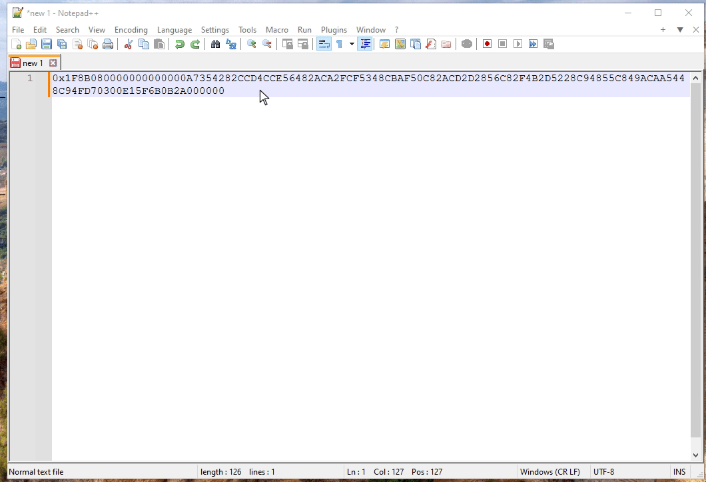

# Npp.SqlVarBinaryGzip: Notepad++ Plugin for GZIP Data Extraction from SQL Server Varbinary Fields

A lightweight Notepad++ plugin that converts GZIP compressed data stored in varbinary fields of SQL Server databases, enabling easy extraction and viewing of compressed content directly within the editor. **This plugin is compatible with the win-x64 runtime only**.

## How to Install the Plugin

1. **Close Notepad++**.
2. **Copy the contents of the [artifacts/win-x64](./artifacts/win-x64/) folder to the plugins directory of your 64-bit Notepad++ installation**:
   - The default plugins directory is `"C:\Program Files\Notepad++\plugins\"`.
   - Alternatively, you can open the plugins directory by navigating to `Plugins -> Open Plugins Folder` in Notepad++, which will open the directory in Windows Explorer.

3. **Restart Notepad++**.
4. **If everything went well, you should see the "SqlVarBinaryGzip" plugin listed under the Plugins menu option**.

